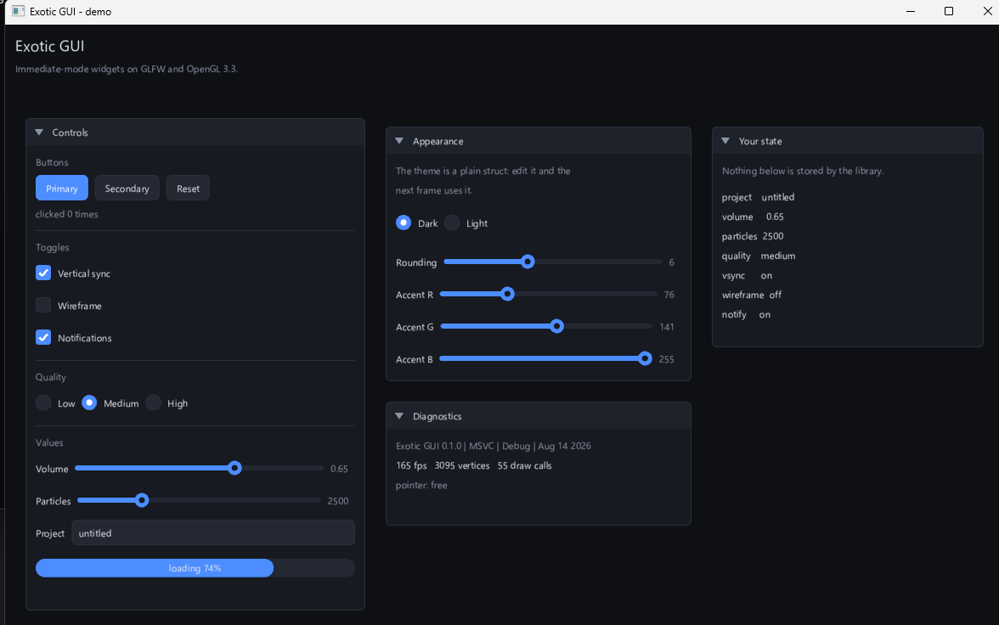

<div align="center">

# Exotic GUI

**An immediate-mode GUI library for modern C++.**

[](https://github.com/ExoticGamerrrYT/exotic-gui-cpp/releases)
[](https://en.cppreference.com/w/cpp/20)
[](https://cmake.org)
[](https://visualstudio.microsoft.com)
[](LICENSE)



</div>

## What it is

You describe the interface every frame with ordinary code. The library turns
that into geometry and draws it in a handful of batched calls.

```cpp
#include <exotic/exotic.hpp>

int main() {
    exo::Window window({.title = "Hello", .width = 900, .height = 560});
    exo::Ui ui(window, exo::Font::system_ui(15.0f));

    float volume = 0.5f;
    bool muted = false;

    while (ui.begin_frame()) {
        ui.begin_panel("Audio", {40, 40, 320, 200});
        ui.slider("Volume", volume, 0.0f, 1.0f);
        ui.checkbox("Mute", muted);
        if (ui.button("Reset")) volume = 0.5f;
        ui.end_panel();

        ui.end_frame();
    }
}
```

There is no widget tree, no callbacks, no code generation and no `.ui` files.
`volume` *is* the state of the slider. Nothing to keep in sync, nothing to
drift apart.

## Why it exists

Most C++ GUI options ask you to adopt a framework: a retained widget tree that
mirrors your data, a signal/slot mechanism, a meta-object compiler, a
build-system takeover. Exotic GUI is a static library you link. It owns a
window, a font atlas and a vertex buffer. It never owns your application state.

## Design decisions

| Area | Choice | Why |
| --- | --- | --- |
| Windowing | [GLFW 3.4](https://www.glfw.org) | Zero raw Win32 in this codebase - no `WNDPROC`, no message pump, no `wgl` boilerplate. |
| Rendering | OpenGL 3.3 core | Available on everything, one batched pass per frame. |
| GL loading | ~45 hand-listed entry points | No glad (needs a Python build step), no GLEW, no OpenGL headers, no import library. |
| Text | [stb_truetype](https://github.com/nothings/stb) | One header. Glyphs are packed into a single 8-bit atlas at load time, 2x2 oversampled. |
| Untextured geometry | Samples a 1x1 white texture | Shapes and glyphs share one shader with no branch. |
| Dependencies | CMake `FetchContent`, pinned by tag and commit | `git clone`, then build. Nothing to install by hand. |
| State model | Immediate mode | The frame is a function of your data, so the two cannot disagree. |
| Theming | A plain struct | Assign a field, the next frame uses it. No style stack, no setters. |

## Architecture

```
   your code          ui.button("Save")
       |
   exo::Ui            layout, widget behaviour, theming, panels     src/ui.cpp
       |
   exo::DrawList      shapes and text -> vertices, indices, batches src/draw.cpp
       |              (pure CPU geometry - unit tested with no window)
   Renderer           one VAO, one streamed buffer, one shader      src/renderer.cpp
       |
   exo::Window        GLFW window, OpenGL context, input            src/window.cpp
```

Each layer is usable on its own: draw straight to `window.draw()` without ever
touching `exo::Ui` (see `examples/shapes`), or drive `exo::Window` yourself and
render something else entirely.

## Widgets

| | |
| --- | --- |
| `label` `heading` `separator` `spacing` | text and structure |
| `button` `button_accent` | actions |
| `checkbox` `radio` | booleans and choices |
| `slider` `slider_int` | continuous values |
| `input_text` | single-line editing, UTF-8 aware caret |
| `progress_bar` | progress |
| `begin_panel` / `end_panel` | draggable, collapsible containers |

Layout is a cursor: widgets stack downwards, `same_line()` rejoins the current
row, `indent()` / `unindent()` shift it and `set_next_width()` overrides the
width of the next widget.

## Requirements

* Windows 10 or 11
* Visual Studio 2022+ with the **Desktop development with C++** workload
* CMake 3.25+ and Ninja - both ship with Visual Studio
* A GPU driver with OpenGL 3.3

## Build

```powershell
git clone https://github.com/ExoticGamerrrYT/exotic-gui-cpp.git
cd exotic-gui-cpp
.\scripts\build.ps1
.\scripts\run.ps1        # the demo above
```

The scripts load the MSVC environment themselves, so a plain PowerShell prompt
is enough.

| Script | Purpose |
| --- | --- |
| `scripts\vsdev.ps1` | Load the MSVC x64 developer environment. |
| `scripts\build.ps1` | Configure + build. `-Config debug\|release`, `-Target`, `-Clean`, `-Fresh`. |
| `scripts\run.ps1` | Build and run an example. `-Example exotic_shapes`. |
| `scripts\test.ps1` | Build and run the test suite through CTest. |
| `scripts\format.ps1` | clang-format the tree. `-Check` to verify only. |
| `scripts\package.ps1` | Produce a release zip in `dist/`. |
| `scripts\clean.ps1` | Delete `build/` and `dist/`. |

CMake presets work directly too:

```powershell
cmake --preset ninja-release
cmake --build --preset ninja-release
ctest --preset ninja-release
```

## Examples

| Example | What it shows |
| --- | --- |
| `exotic_hello_window` | The smallest program: a window, input, nothing else. |
| `exotic_shapes` | The renderer on its own - shapes, text, clipping, animation. |
| `exotic_demo` | Every widget, plus live theme editing. |

## Using it in your project

With `FetchContent`, pinned to a release:

```cmake
include(FetchContent)
FetchContent_Declare(exotic_gui
    GIT_REPOSITORY https://github.com/ExoticGamerrrYT/exotic-gui-cpp.git
    GIT_TAG        v0.1.0)
FetchContent_MakeAvailable(exotic_gui)

target_link_libraries(my_app PRIVATE exotic::gui)
```

Or install it and use the package config:

```powershell
cmake --preset ninja-release
cmake --build --preset ninja-release --target install
```

```cmake
find_package(ExoticGui 0.1 REQUIRED)
target_link_libraries(my_app PRIVATE exotic::gui)
```

GLFW is fetched and built automatically in both cases; there is nothing else to
install.

## Layout

```
exotic-gui-cpp/
├── cmake/            dependency, install and export modules
├── docs/             screenshots and images
├── examples/         hello_window, shapes, demo
├── include/exotic/   the entire public API
│   ├── exotic.hpp    umbrella header
│   ├── types.hpp     Vec2, Rect, Color
│   ├── window.hpp    Window, input, keys, cursors
│   ├── draw.hpp      DrawList, Vertex, DrawCmd
│   ├── font.hpp      Font atlas and metrics
│   ├── theme.hpp     colours and metrics
│   └── ui.hpp        immediate-mode widgets
├── src/              implementation and private headers (gl, renderer, utf8)
├── tests/            framework-free suite driven by CTest
├── scripts/          PowerShell developer scripts
├── CMakeLists.txt
└── CMakePresets.json
```

## Testing

The suite is a plain executable whose exit code is the result - no framework to
fetch, nothing to install, milliseconds to run. `CHECK` records a failure and
keeps going, so one broken thing does not hide the next. It works identically
in Release, unlike `assert`.

```powershell
.\scripts\test.ps1
```

Geometry, batching, clipping, colour packing, id hashing and theme scaling are
all covered without opening a window. Widget behaviour is verified by driving
synthetic mouse and keyboard input into the demo.

## Limitations

Honest list of what 0.1 does not do yet:

* Panels do not scroll, and they do not reorder when clicked.
* The atlas covers ASCII and Latin-1 - no CJK, no emoji, no font fallback.
* Text editing has a caret but no selection and no clipboard.
* Windows only in practice: GLFW and the renderer are portable, but nothing
  else has been built or tested.
* Static library only; no shared build.

## Versioning

[Semantic Versioning](https://semver.org). Before 1.0 the minor version may
break the API; the patch version never will. See [CHANGELOG.md](CHANGELOG.md).

## Contributing

Bug reports and pull requests are welcome - see
[CONTRIBUTING.md](CONTRIBUTING.md).

## License

MIT - see [LICENSE](LICENSE).

Third-party: [GLFW](https://github.com/glfw/glfw) (zlib/libpng) and
[stb_truetype](https://github.com/nothings/stb) (MIT / public domain).
